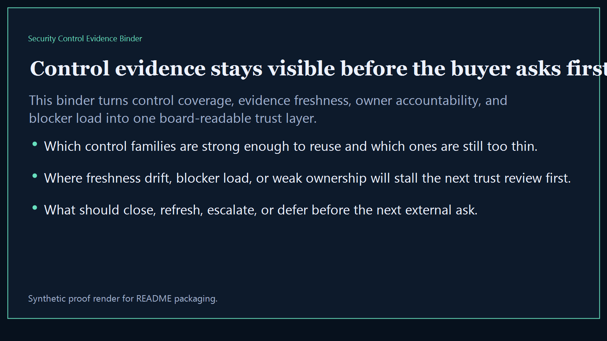
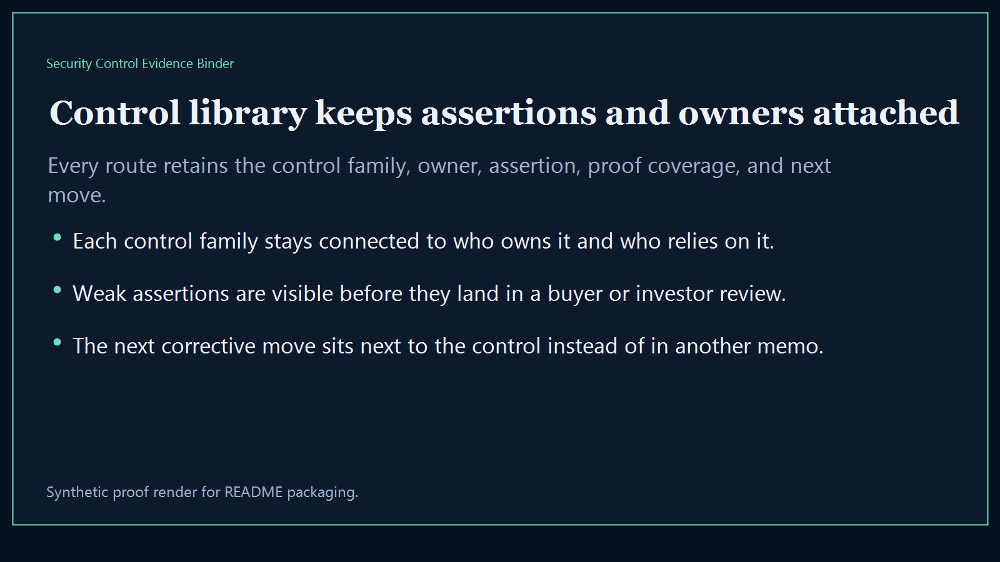
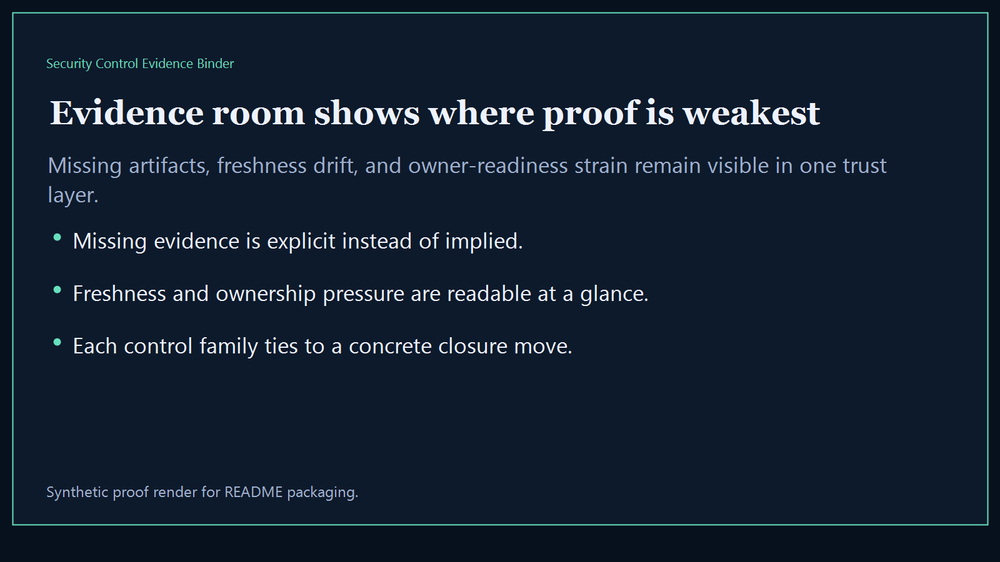
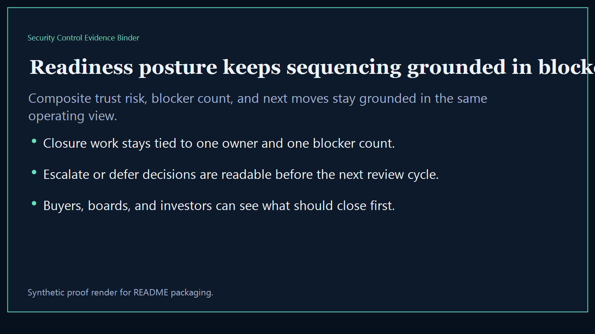

# Security Control Evidence Binder

Board-ready security evidence surface for packaging controls, proofs, owner accountability, and trust-ready narratives into one reusable binder for buyers, investors, and partner reviews.

- Live: `https://controls.kineticgain.com/`
- Repo: `mizcausevic-dev/security-control-evidence-binder`

## Why this matters

Leaders need one control binder that shows which security assertions are fully backed, which control families are stale or thin, which owners are blocking readiness, and what can safely be handed to the next buyer or diligence review.

## What it includes

- TypeScript executive-intelligence surface for control packaging, evidence freshness, owner accountability, and buyer-safe review posture
- synthetic control families across AI governance, identity, platform security, procurement trust, revenue controls, and regulated systems
- reusable outputs for control library, evidence room, readiness posture, and board-ready trust narratives
- prerendered static site, JSON payloads, screenshots, and docs

## Routes

- `/`
- `/control-library`
- `/evidence-room`
- `/readiness-posture`
- `/verification`
- `/docs`

## Local run

```bash
cd security-control-evidence-binder
npm install
npm run verify
npm run prerender
npm run render:assets
```

## CLI

```bash
npx security-control-evidence-binder fixtures/security-control-evidence-binder.json --format summary
npx security-control-evidence-binder fixtures/security-control-evidence-binder-clean.json --format json
```

## Docs

- [Architecture](docs/architecture.md)
- [Origin](docs/ORIGIN.md)
- [Kinetic Gain Embedded](docs/KINETIC_GAIN_EMBEDDED.md)

## Screenshots





